# 💼 AI JobAgent (v2.0)

[](https://www.python.org/)
[](https://fastapi.tiangolo.com/)
[](https://opensource.org/licenses/MIT)
[](https://app.netlify.com/)

An advanced, MNC-grade enterprise job agent that parses resumes, calculates ATS matching scores, queries multiple global job search engines, automatically identifies skill gaps, constructs visual learning roadmaps, and provides a suite of generative AI career acceleration tools.

---

## 🎥 Walkthrough & Demo

Recruiters and developers can watch the full, step-by-step video demonstration of the AI JobAgent platform here:

[](https://drive.google.com/file/d/1MgUpAeVpGmqT0FpnUtz4pyGnOGV30Fl7/view?usp=sharing)

---

## 🚀 Key Features

*   **Smart Two-Column PDF Parser**: Preserves reading order in two-column layouts using PyMuPDF bounding-box grouping.
*   **7-Tier Cascading AI Router**: Resilient cloud fallback chain running **Groq (Llama 3.3)** ➡️ **OpenRouter (Llama 3)** ➡️ **Together AI** ➡️ **Cohere** ➡️ **Hugging Face** ➡️ **Gemini 2.0 Flash** ➡️ **Local Ollama**.
*   **6-Board Live Job Engine**: Aggregates local and international listings in real-time from **LinkedIn, Indeed, Naukri, Foundit, Glassdoor, and Wellfound** via SerpApi and JSearch.
*   **Auto-Learning Recommendation System**: Ranks in-demand missing skills from matched job descriptions and suggests certified learning courses and portfolio projects.
*   **Advanced Career Toolset**: Generates cover letters, cold outreach emails, mock technical interview prep, and salary predictions.
*   **Luxury Glassmorphism UI**: High-fidelity static single-page dashboard with full responsive layout and dark/light theme toggle.

---

## 🖼️ Application Screenshots

### 📊 Core Dashboard & Resume Analyzer
| 1. Dashboard & ATS Landing | 2. Parsed Profile Suitability |
|---|---|
| 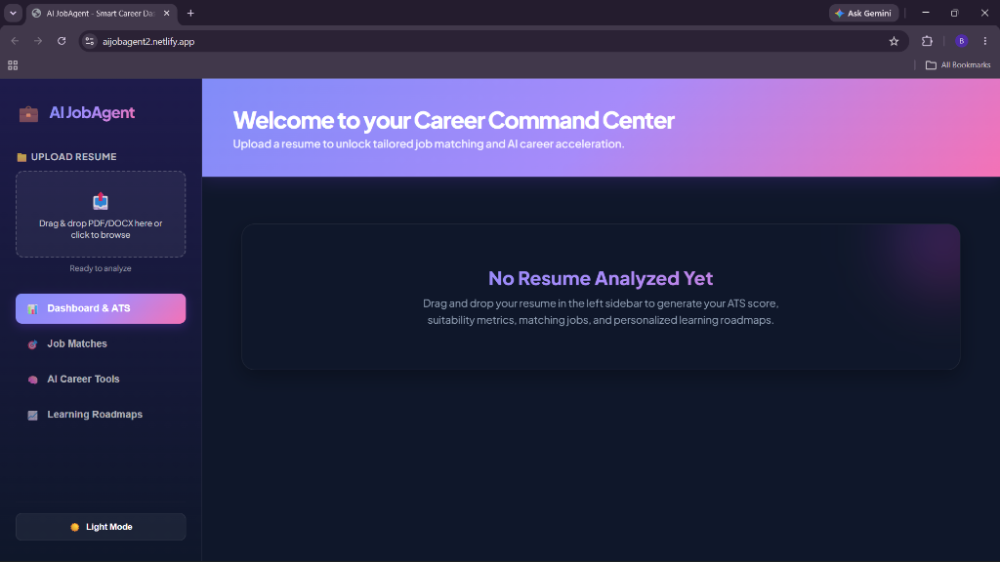 | 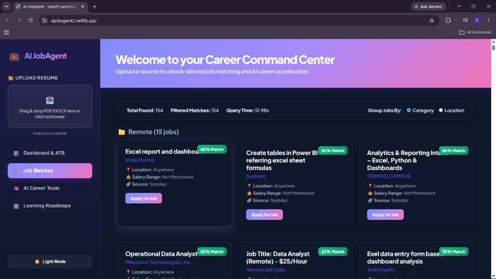 |

| 3. Detailed ATS Metrics | 4. Real-time Matched Jobs |
|---|---|
| 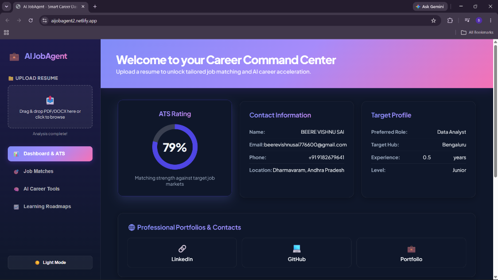 | 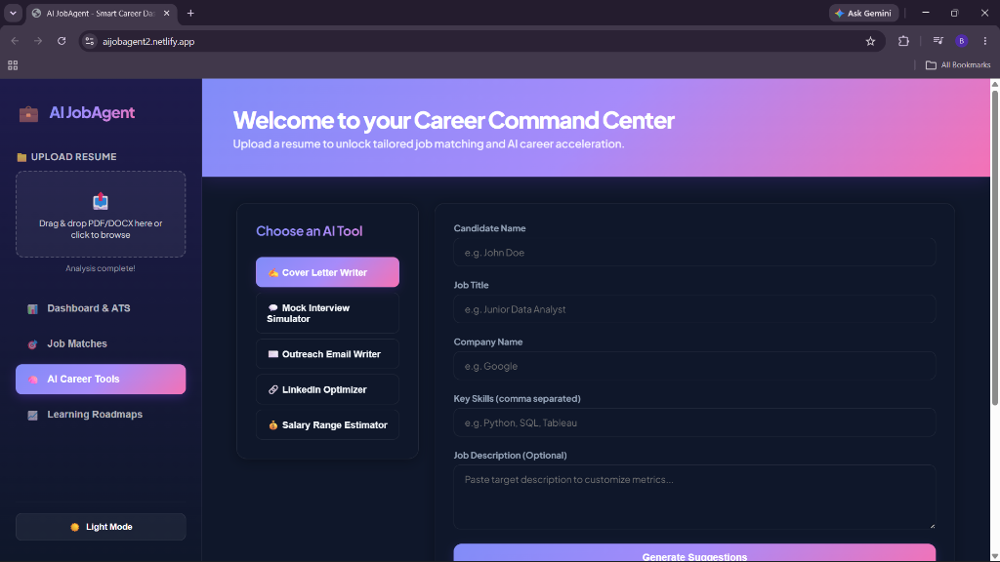 |

### 🤖 Generative AI Career Tools in Action
| 5. Cover Letter Generator Input | 6. Tailored Cover Letter Output |
|---|---|
| 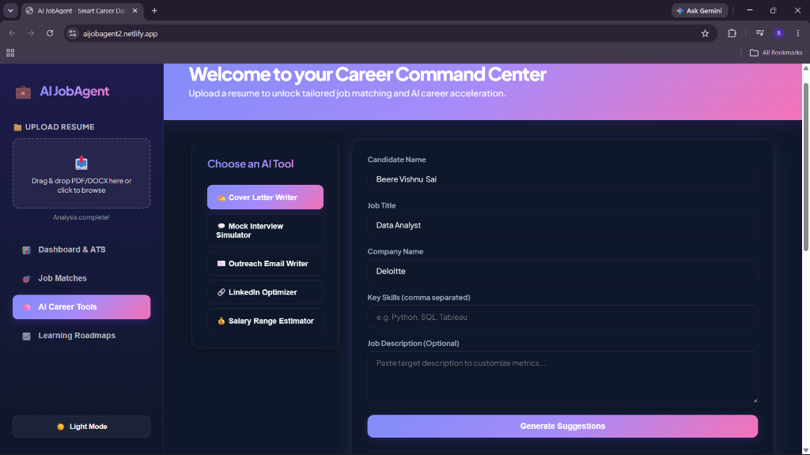 | 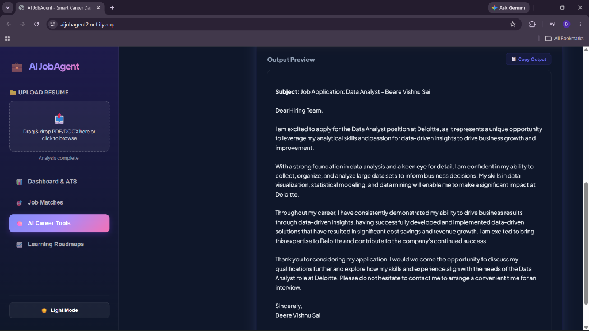 |

| 7. Outreach Email Writer Input | 8. Cold Networking Outreach Output |
|---|---|
| 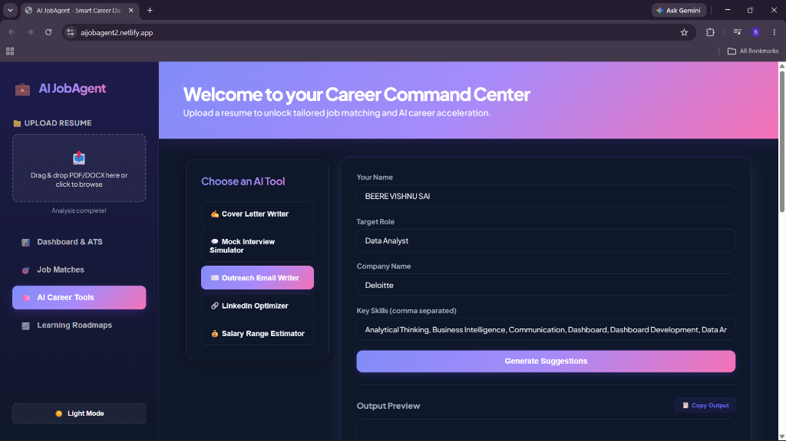 | 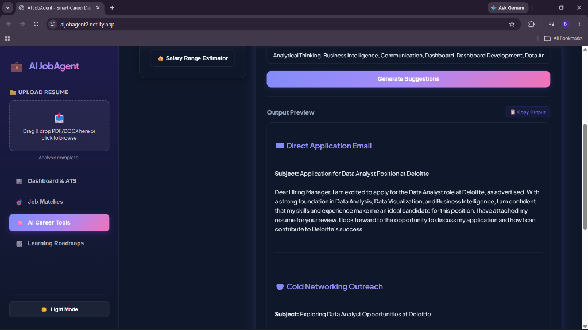 |

| 9. LinkedIn Optimizer Input | 10. LinkedIn Suggested Headlines & Summary |
|---|---|
| 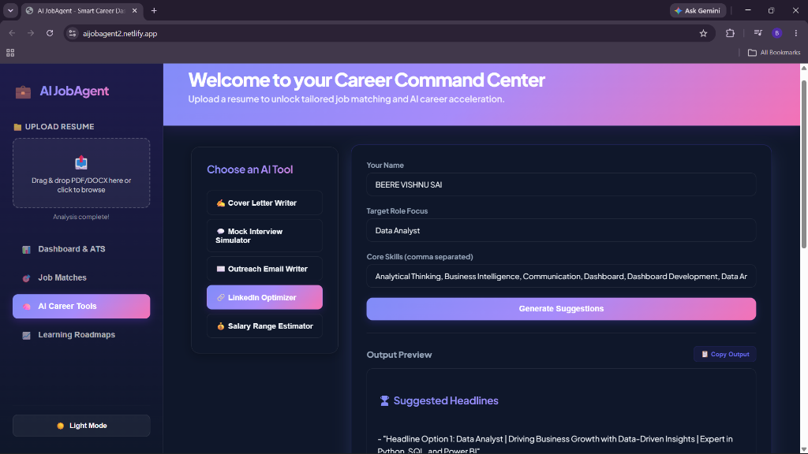 | 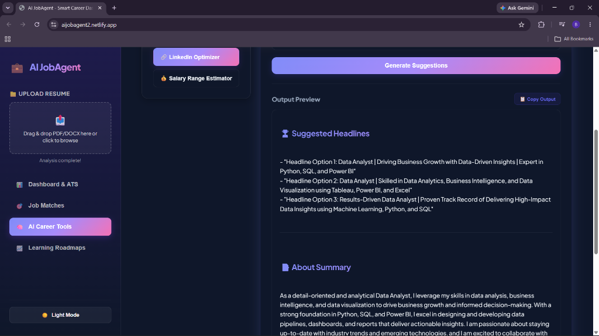 |

| 11. Salary Estimator Input | 12. Predicted Market Salary Range |
|---|---|
| 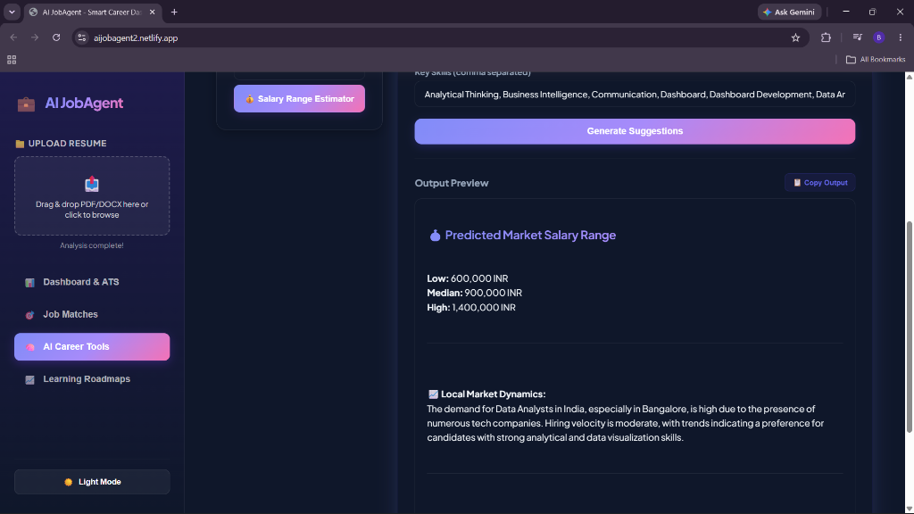 | 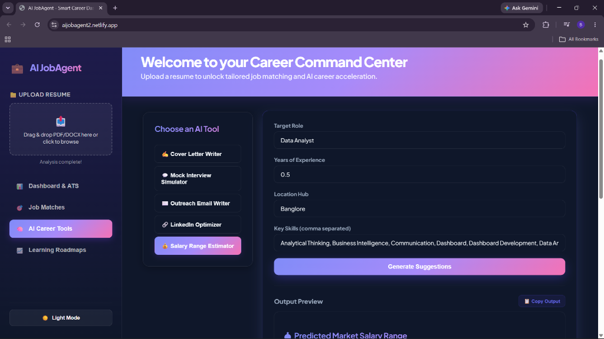 |

### 🧠 Mock Technical Interview Simulator
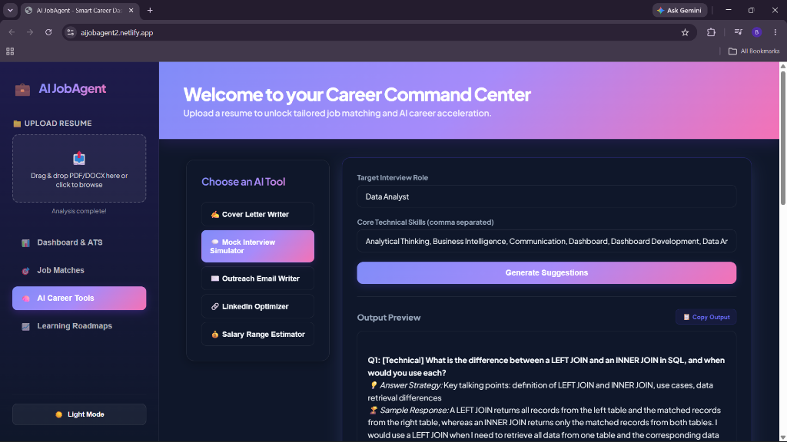

---

## 📐 Architecture Diagram

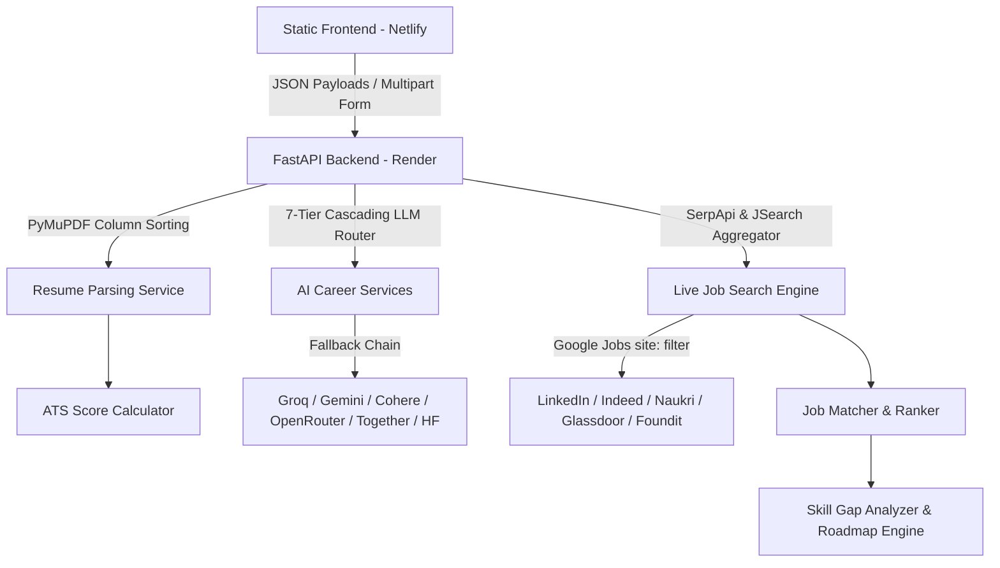

---

## 📂 Project Structure

```text
AI_Job_Agent/
│
├── frontend/                  # Static SPA hosted on Netlify
│   ├── index.html            # Luxury UI skeleton layout
│   ├── style.css             # Glassmorphism design system & variables
│   └── app.js                # State management, drag-drop, API handlers
│
├── providers/                 # Standardized Job Search Connectors
│   ├── base.py               # Abstract Base Provider
│   ├── serpapi.py            # Google Jobs aggregator base
│   ├── linkedin.py           # LinkedIn job target connector
│   ├── naukri.py             # Naukri.com target connector
│   ├── indeed.py             # Indeed target connector
│   ├── foundit.py            # Foundit.in target connector
│   ├── glassdoor.py          # Glassdoor target connector
│   ├── wellfound.py          # Wellfound target connector
│   ├── jsearch.py            # RapidAPI JSearch integration
│   ├── adzuna.py             # Adzuna job search API
│   ├── jooble.py             # Jooble job search API
│   ├── remotive.py           # Remotive remote API
│   └── remoteok.py           # RemoteOK remote API
│
├── services/                  # Business Logic & Core Algorithms
│   ├── ats_calculator.py     # ATS score calculation weights
│   ├── resume_parser.py      # Column-aware PDF text extraction
│   ├── resume_enricher.py    # Social links & location inference
│   ├── job_matcher.py        # Weighted job-to-resume matching
│   ├── search_jobs.py        # Master job search aggregator
│   └── cover_letter_generator.py # Generative letter writing
│
├── models/                    # Data Structures & Schemas
│   ├── resume.py             # ResumeData schema
│   ├── job.py                # JobData schema
│   └── search.py             # SearchResult schema
│
├── utils/                     # Shared Utilities
│   ├── llm.py                # 7-Tier Cloud Fallback Router
│   └── logger.py             # Consolidated application logging
│
├── app.py                     # FastAPI Application Endpoints
├── config.py                  # Environment Configuration
├── netlify.toml               # Netlify Deploy Routing config
└── requirements.txt           # Python Dependencies
```

---

## 🛠️ Installation & Local Setup

### 1. Prerequisites
*   Python 3.10 or higher
*   (Optional) Ollama running locally with `llama3.2` model if running without cloud API keys.

### 2. Setup steps
1.  Clone the repository:
    ```bash
    git clone https://github.com/Vishnu-Sai-bit/AI_Job_Agent.git
    cd AI_Job_Agent
    ```
2.  Install dependencies:
    ```bash
    pip install -r requirements.txt
    ```
3.  Create a `.env` file in the root directory:
    ```env
    # LLM Keys (Configure at least one for cloud operation)
    GROQ_API_KEY=your_groq_key
    GEMINI_API_KEY=your_gemini_key
    COHERE_API_KEY=your_cohere_key
    OPENROUTER_API_KEY=your_openrouter_key
    TOGETHER_API_KEY=your_together_key
    HF_API_KEY=your_huggingface_key

    # Job API Keys
    SERPAPI_API_KEY=your_serpapi_key
    RAPIDAPI_KEY=your_rapidapi_key
    ADZUNA_APP_ID=your_adzuna_id
    ADZUNA_APP_KEY=your_adzuna_key
    JOOBLE_API_KEY=your_jooble_key
    ```
4.  Run the system locally:
    ```bash
    .\start.bat
    ```

---

## 🌐 Deployment Configuration

### 1. Backend (FastAPI on Render)
*   **Build Command**: `pip install -r requirements.txt`
*   **Start Command**: `uvicorn app:app --host 0.0.0.0 --port $PORT`
*   **Environment Variables**: Add your API keys (`GROQ_API_KEY`, `SERPAPI_API_KEY`, etc.) under the Environment Settings tab.

### 2. Frontend (Static SPA on Netlify)
*   Deploy from the same repository. Netlify will auto-detect the `netlify.toml` file and set:
    *   **Publish Directory**: `frontend`
    *   **Build Command**: *(Leave empty)*

---

## 🛡️ License

Distributed under the MIT License. See [LICENSE](LICENSE) for more information.

---

## 👤 Author

**Beere Vishnu Sai**
*   GitHub: [@Vishnu-Sai-bit](https://github.com/Vishnu-Sai-bit)
*   LinkedIn: [Beere Vishnu Sai](https://www.linkedin.com/in/vishnu-sai-beere/)
