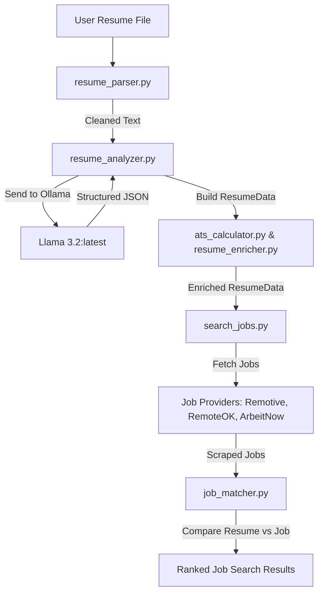

# AI JobAgent Project Overview

Welcome to your **AI JobAgent** repository review. This document outlines the project's architecture, dependencies, core services, data flow, and overall codebase health.

---

## 📂 Project Structure

Here is a map of the repository's modules and directories:

```
c:/JobAgent
├── app.py                     # FastAPI REST API Backend Entrypoint
├── config.py                  # Central configuration settings
├── requirements.txt           # Project dependencies (UTF-16LE encoded)
├── exceptions/                # Custom domain-specific exception handling
│   ├── __init__.py
│   └── custom_exceptions.py
├── models/                    # Domain data models (Dataclasses)
│   ├── __init__.py
│   ├── ats.py                 # ATS score reports
│   ├── dashboard.py           # Dashboard stats
│   ├── job.py                 # Scraped job listing schema
│   ├── resume.py              # Extracted and structured resume data
│   └── search.py              # Search engine results schema
├── providers/                 # Integrations with job scrapers/APIs
│   ├── __init__.py
│   ├── arbeitnow.py           # Arbeitnow API
│   ├── remoteok.py            # RemoteOK API
│   └── remotive.py            # Remotive API
├── services/                  # Business Logic layer
│   ├── ats_calculator.py      # Resume ATS score calculation
│   ├── contact_extractor.py   # Extract emails, phones, URLs
│   ├── experience_parser.py   # Parse candidate's professional tenure
│   ├── job_matcher.py         # Match resumes to job requirements
│   ├── location_parser.py     # Parse and normalize geographic details
│   ├── resume_analyzer.py     # Ollama API orchestrator for resume structure
│   ├── resume_enricher.py     # Pull secondary fields (LinkedIn/GitHub/Portfolio)
│   ├── resume_parser.py       # File-to-text parsers (PDF, Docx, Doc, RTF, ODT, TXT)
│   ├── salary_parser.py       # Parse salary ranges
│   ├── search_jobs.py         # Orchestrate provider requests and filter/sort jobs
│   └── skill_extractor.py     # Extract skills matching resume context
├── utils/                     # Generic helper modules
│   ├── __init__.py
│   ├── helpers.py             # Data deduplication & general utilities
│   └── logger.py              # Customized file/console logging configuration
├── config/                    # Empty configuration dir (placeholder)
```

---

## ⚙️ Core Architecture & Flow

The backend functions as an **AI-driven Resume Parser and Job Matcher**:



### 1. Document Extraction (`services/resume_parser.py`)
- Reads and extracts raw text from PDF, DOCX, DOC, TXT, RTF, and ODT.
- Relies on libraries like `pymupdf` (fitz), `python-docx`, `striprtf`, and `textract`.

### 2. AI Structuring (`services/resume_analyzer.py`)
- Formulates a system prompt for structured JSON generation.
- Queries a local model (defaulting to **Llama 3.2** via Ollama) running at `http://localhost:11434`.
- Validates the returned schema to map directly to `ResumeData`.

### 3. Scoring & Job Matching (`services/ats_calculator.py` & `services/job_matcher.py`)
- **ATS Score**: Weighs Contact Info (10%), Skills (30%), Education (15%), Experience (20%), Projects (15%), and Certifications (10%).
- **Job Matching**: Ranks scraped jobs by comparing job descriptions and title keywords against candidate skills and preferences.

---

## 🛠️ Verification & Compile Checks

A recursive compilation check of all `.py` files was conducted:
```powershell
Get-ChildItem -Filter *.py -Recurse | ForEach-Object { python -m py_compile $_.FullName }
```
**Status**: `SUCCESSFUL` (No syntax or syntax-level import errors found in the Python codebase).

---

## 📝 Observations & Recommendations

1. **Ollama Dependencies**:
   - The application relies on `OLLAMA_MODEL = "llama3.2:latest"` on local port `11434`. Ensure Ollama is running and has the model pulled (`ollama pull llama3.2`) before testing/starting.
2. **Streamlit UI**:
   - The comments inside `services/resume_parser.py` mention a "Streamlit UI" usage, and `Streamlit` is listed in `requirements.txt`. However, there is no Streamlit frontend file in this folder (e.g., `main_ui.py` or similar). If you have it elsewhere or need help building one, let me know!
3. **CORS Settings**:
   - By default, requests from origins `http://localhost:8000`, `http://127.0.0.1:8000`, `http://localhost:8501`, and `http://127.0.0.1:8501` are allowed. This matches the standard FastAPI and Streamlit dev ports.
